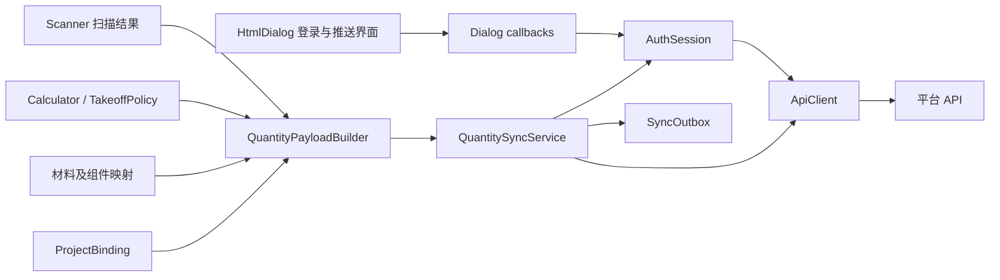
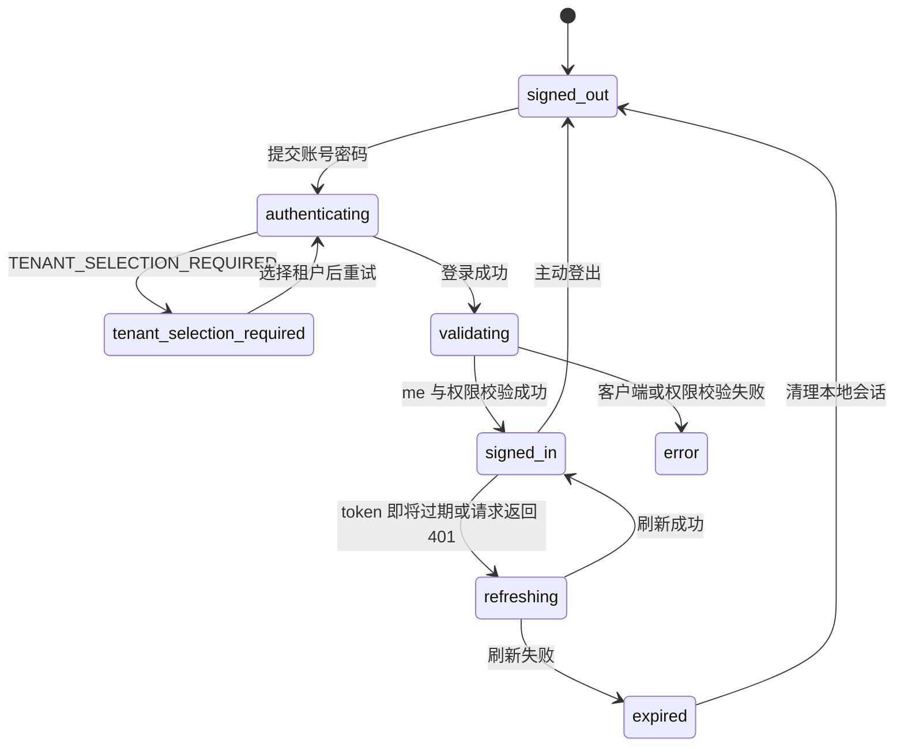
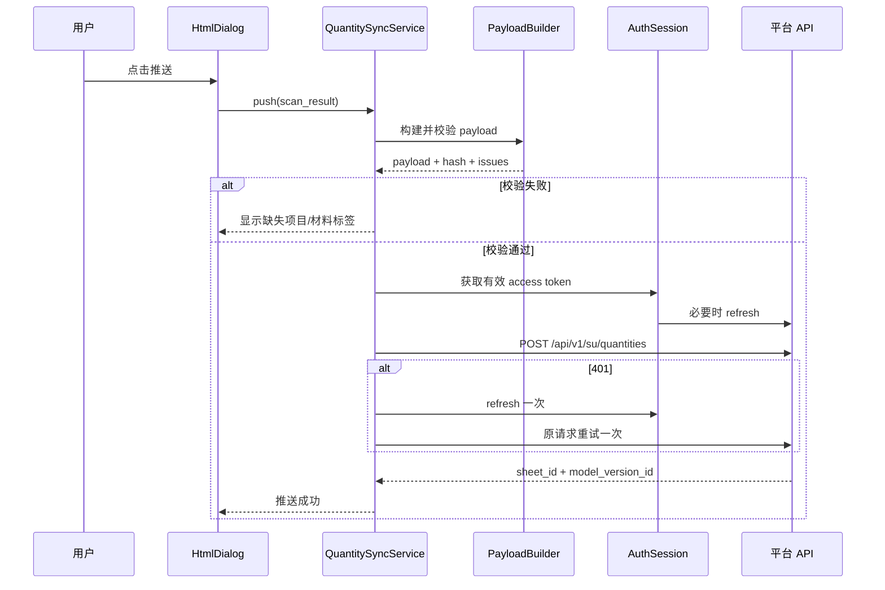

# SU Takeoff API 对接设计方案

## 1. 文档信息

- 文档状态：设计基线
- 适用项目：SU Takeoff SketchUp 插件
- 对接协议：SU 智能算量协议 v2
- 客户端标识：`su-plugin`
- 服务端契约来源：`docs/su-plugin-integration.md`
- 设计日期：2026-07-27

本文档用于指导插件身份认证、会话管理、算量数据组装及云端推送功能的开发。后续实现应以本文档为设计基线；如服务端契约发生变化，应先更新接口文档和本文档，再修改代码。

## 2. 目标与范围

### 2.1 目标

1. 支持平台账号登录、多租户选择、会话恢复和主动登出。
2. 使用系统安全存储保存 refresh token，避免密码和 token 泄露。
3. 将插件现有扫描及算量结果转换为平台 SU v2 payload。
4. 保证模型、组件、面和部品编码跨推送尽量稳定。
5. 支持 access token 自动刷新、请求幂等、有限重试和失败恢复。
6. 在不阻塞 SketchUp UI 的前提下完成网络请求。
7. 通过纯 Ruby 单元测试覆盖 HTTP、认证、payload 和重试逻辑。

### 2.2 首期范围

首期接入以下接口：

| 方法 | 接口 | 用途 |
| --- | --- | --- |
| `POST` | `/api/v1/auth/login` | 登录并获取 token |
| `POST` | `/api/v1/auth/refresh` | 刷新并轮换 token |
| `POST` | `/api/v1/auth/logout` | 注销当前会话 |
| `GET` | `/api/v1/identity/me` | 校验账号、租户和权限 |
| `POST` | `/api/v1/su/quantities` | 推送 SU v2 算量数据 |

首期不接入：

- 当前用户会话列表。
- 平台失败记录重放接口。
- 管理端算量单列表、详情、对比和导出接口。
- 运营版本和 SKU 匹配接口。

### 2.3 功能门禁

采用“进入插件先校验登录状态，登录后才能使用插件功能”的策略：

- 打开 HtmlDialog 后先进入独立登录页，尝试用安全存储中的 refresh token 恢复会话。
- 未登录时，扫描、材料映射、组件映射、参数管理、本地统计、定位和标签写入均不可用。
- 登录成功后解锁本地插件功能。
- 推送到平台仍需额外校验 `quantity:ingest` 权限；缺少该权限时保留登录状态并允许本地功能，但禁用云端推送。

## 3. 现状与主要差距

插件当前数据链路为：

```text
Scanner -> WorkbenchPresenter -> JSON -> HtmlDialog
```

当前结构主要服务于界面展示，与平台 payload 存在以下差距：

| 项目 | 当前状态 | 对接要求 |
| --- | --- | --- |
| 登录与会话 | 无 | 支持登录、租户选择、refresh、logout、me |
| HTTP 客户端 | 无 | HTTPS、超时、JSON、错误模型、重试 |
| 项目信息 | 无平台项目绑定 | 必须提供 `project.code` 和 `project.name` |
| 模型标识 | 无稳定平台标识 | 必须提供持久化 `model_key` |
| 实体编码 | 主要使用 `entityID` | 平台编码应使用 `persistent_id` 和实例路径 |
| 材料标签 | 只有材料名称、分类、单位、规格 | 必须新增稳定的 `platform_material_tag` |
| Payload | 只有工作台展示数据 | 必须构建 SU v2 `components/parts`；面积聚合为部品，不上传具体面 |
| 幂等和版本 | 无 | 同一内容复用幂等键，内容变化生成新版本 |
| 失败恢复 | 无 | 有限重试和本地待重试记录 |

`WorkbenchPresenter` 会对数据进行展示型聚合并剥离面详情，因此平台 payload 不应从前端 `_workbench` 或 HtmlDialog 中反向组装。

## 4. 总体架构



### 4.1 建议文件结构

```text
src/
  api/
    api_error.rb
    http_response.rb
    api_client.rb
    auth_session.rb
    credential_store.rb
    project_binding.rb
    quantity_payload_builder.rb
    quantity_sync_service.rb
    sync_outbox.rb
  ui/
    dialog.rb
    index.html
    app.js
    js/
      auth.js
      cloud_sync.js
```

测试文件：

```text
test/
  test_api_client.rb
  test_auth_session.rb
  test_project_binding.rb
  test_quantity_payload_builder.rb
  test_quantity_sync_service.rb
  test_sync_outbox.rb
```

### 4.2 模块职责

#### `ApiClient`

- 统一拼接 Base URL 和 API path。
- 仅允许生产环境使用 HTTPS。
- 设置连接和读取超时。
- 发送 JSON 请求并解析 JSON 或空响应。
- 生成脱敏请求 ID，禁止记录 Authorization 和请求正文。
- 将非成功响应转换为 `ApiError`。
- 不负责业务重试和登录状态。

#### `ApiError`

建议字段：

```ruby
status
code
message
details
retryable
```

错误消息优先使用服务端结构化 `message`，无法解析时使用通用提示。禁止把 token、密码或完整 payload 放入异常文本。

#### `AuthSession`

- 内存保存 access token、过期时间、subject 和当前用户信息。
- 使用 `CredentialStore` 读取、覆盖和删除 refresh token。
- 实现登录、多租户重新登录、静默恢复、刷新、登出和 `/identity/me` 自检。
- 校验 `client_id == su-plugin`。
- 校验 `permissions` 包含 `quantity:ingest`。
- 401 时只允许刷新并重试一次，防止循环刷新。
- refresh token 轮换后立即覆盖旧 token。

#### `CredentialStore`

- macOS 使用 Keychain。
- Windows 使用 Credential Manager。
- token 的存储键至少区分 API 环境和登录账号。
- 安全存储不可用时，不降级到明文文件或模型属性。
- 安全存储不可用时仅维持当前 SketchUp 进程内会话，重启后重新登录。

`Sketchup.write_default` 只可保存非敏感元数据，例如上次登录用户名和 API 环境，不能保存 access token 或 refresh token。

#### `ProjectBinding`

保存当前模型与平台项目的绑定信息：

```json
{
  "project_code": "XM-001",
  "project_name": "样板房",
  "model_key": "generated-uuid",
  "last_payload_hash": "sha256...",
  "last_idempotency_key": "su-v2-...",
  "last_sheet_id": "sheet-id",
  "last_model_version_id": "version-id",
  "last_synced_at": "2026-07-27T10:30:00+08:00"
}
```

该信息写入模型 AttributeDictionary，随 `.skp` 文件保存。字典建议使用独立名称 `su_takeoff_cloud`，避免与现有算量配置混杂。

token、密码和失败 payload 不得写入模型。

#### `QuantityPayloadBuilder`

- 直接消费 Scanner 结果、Calculator 决议、Mapping 和 ProjectBinding。
- 不依赖 HtmlDialog 或 `_workbench`。
- 使用确定性排序和固定精度生成规范化 payload。
- 生成稳定的 component、face 和 part 编码。
- 验证必填项目字段和材料标签。
- 输出 payload、payload hash 和校验问题列表。

#### `QuantitySyncService`

- 控制同一时刻只能有一个推送任务。
- 调用 Payload Builder，再调用认证和推送接口。
- 401 时 refresh 并重试原请求一次。
- 对网络异常、429 和 5xx 执行有限次数退避重试。
- 成功后更新 ProjectBinding。
- 最终失败时写入 SyncOutbox。

#### `SyncOutbox`

- 保存不含 token 的待重试 payload 和必要元数据。
- 同一个 idempotency key 只保留一条记录。
- 限制记录数量和磁盘占用。
- 成功重试后删除对应记录。
- 普通日志只记录 payload hash，不记录完整 payload。

## 5. 登录与会话设计

### 5.1 登录状态

```text
signed_out
authenticating
tenant_selection_required
validating
signed_in
refreshing
expired
error
```

状态转换：



### 5.2 登录请求

```json
{
  "username": "designer@example.com",
  "password": "password",
  "client_id": "su-plugin",
  "tenant_id": "optional-tenant-id"
}
```

处理规则：

1. `client_id` 由 Ruby 客户端固定注入，前端不能覆盖。
2. 用户名去除首尾空白，密码不做修改。
3. 多租户响应按业务 `code == TENANT_SELECTION_REQUIRED` 判断，不仅依赖 HTTP 状态。
4. 选择租户后再次调用登录接口。
5. 登录成功后立即清空前端密码输入框。
6. 登录成功后调用 `/identity/me` 自检。

### 5.3 会话恢复

打开 Dialog 时执行：

1. 从安全存储读取 refresh token。
2. 没有 refresh token 时进入 `signed_out`。
3. 有 refresh token 时调用 refresh。
4. 用响应中的新 refresh token覆盖旧 token。
5. 调用 `/identity/me`。
6. 校验失败时清理本地会话并回到登录状态。

access token 不依赖解析 JWT 判断有效性，使用服务端 `expires_in` 计算内存过期时间。建议在到期前 60 秒主动刷新。

### 5.4 登出

1. 有 access token 时尽力调用服务端 logout。
2. 无论网络调用是否成功，都清除内存 token 和安全存储中的 refresh token。
3. 清空 subject、用户信息和租户信息。
4. 通知前端切换为未登录状态。

### 5.5 权限校验

登录成功不等于具备推送权限。`/identity/me` 至少校验：

- `client_id == "su-plugin"`。
- subject 属于租户上下文。
- `permissions` 包含 `quantity:ingest`。

缺少权限时仍可保留已登录身份，但云端推送按钮必须禁用并显示明确原因。

## 6. HTTP 与线程模型

### 6.1 HTTP 配置

建议默认配置：

| 项目 | 登录/刷新/me | 算量推送 |
| --- | --- | --- |
| 连接超时 | 10 秒 | 10 秒 |
| 读取超时 | 30 秒 | 120 秒 |
| Content-Type | `application/json` | `application/json` |
| TLS | 校验证书和主机名 | 校验证书和主机名 |

Base URL 由环境配置提供，路径由客户端常量维护。生产配置必须是 HTTPS 域名，不允许使用容器端口、`127.0.0.1` 或明文 HTTP。

### 6.2 SketchUp 线程边界

网络调用不能长时间占用 SketchUp UI 主线程。

推荐流程：

1. 在主线程读取 SketchUp 模型并构建完整 payload。
2. 后台 Ruby Thread 只执行 HTTP、JSON 和文件队列操作。
3. 后台线程不得调用 SketchUp API。
4. 请求完成后通过 `UI.start_timer(0, false)` 回到主线程。
5. 主线程更新模型 AttributeDictionary 和 HtmlDialog。

Dialog 销毁后，异步结果应安全丢弃，不再调用已关闭的 HtmlDialog。

## 7. SU v2 Payload 设计

### 7.1 顶层结构

```json
{
  "protocol_version": 2,
  "idempotency_key": "su-v2-model-uuid-content-hash",
  "project": {
    "code": "XM-001",
    "name": "样板房"
  },
  "designer_account": "designer@example.com",
  "model_key": "model-uuid",
  "model_version_no": "V2026.08.05",
  "update_content": "调整卫生间龙头数量并补充灯具",
  "source_version": "sha256:content-hash",
  "components": []
}
```

### 7.2 字段映射

| API 字段 | 插件来源 | 规则 |
| --- | --- | --- |
| `protocol_version` | 常量 | 固定为 `2` |
| `project.code` | ProjectBinding | 必填，不能用项目名称替代 |
| `project.name` | ProjectBinding | 必填，可首次默认模型标题 |
| `designer_account` | AuthSession.account | 当前登录设计师账号；写入推送请求体并参与业务 hash，不发送密码或 Token |
| `model_key` | ProjectBinding | 首次绑定生成 UUID，后续保持不变 |
| `model_version_no` | 推送确认窗口 | 用户填写的模型版本号；最长 64 个字符；参与业务 hash；后端可缺省兼容旧插件 |
| `update_content` | 推送确认窗口 | 用户填写的更新内容；最长 2000 个字符；参与业务 hash；后端可缺省兼容旧插件 |
| `source_version` | Payload Builder | 规范化业务内容的 SHA-256 |
| `idempotency_key` | Payload Builder | 由协议、model_key、project.code 和内容 hash 生成 |
| `components` | WorkbenchPresenter.component_rows | 复用按组件页面的最终行数据；模型根仅用于界面总计，不上传 |
| `components[].quantity_tag` | WorkbenchPresenter.component_rows.tag | 组件当前选择的算量标签；复合标签作为一个字符串发送；未选择时不发送 |
| `components[].project_product_id` | ComponentSkuMapping + hierarchy | 组件有项目产品关联时发送项目产品 ID；参与内容 hash |

### 7.3 稳定编码

当前插件使用的 `entityID` 适用于当前 SketchUp 会话定位，但不能作为平台长期稳定编码。

平台编码使用：

- 组件：从模型根到当前实例的 `persistent_id` 路径。
- 面：只在插件本地用于洞口扣减和几何计算，不进入推送 Payload。
- 部品：组件编码、材料名称、计量方式和单位组成的稳定摘要；面积面也聚合为部品。
- 模型根直属面：只参与插件界面总计，不进入当前推送 Payload。

建议编码格式：

```text
component: c-<hash(instance_persistent_path)>
part:      p-<hash(component_code + material_name + method + unit)>
```

对外编码使用短前缀加 SHA-256 摘要，避免路径过长和特殊字符问题。编码原始字段保留在内存调试信息中，不写普通日志。

Scanner 和 `ScanItem` 需要新增：

```text
face_persistent_id
component_path_persistent_ids
```

现有 `face_id` 和 `component_path_ids` 继续用于当前会话内的定位和 UI 高亮，不能删除。

### 7.4 Component 映射

每个确认推送时页面可见的群组/组件树节点生成一个 Component，即使该行四个数量列都显示 `-` 也要生成，`parts` 为空数组。行数据由 `WorkbenchPresenter` 统一计算，标签变更后页面和推送使用同一份结果；模型根总计行不上传。嵌套容器只有在页面展开并显示为树节点时才上传，折叠状态下不可见的子级组件不上传；当前服务端协议没有父组件字段，因此仍以扁平列表上传。

```json
{
  "code": "c-abc123",
  "name": "橱柜",
  "component_type": "cabinet",
  "quantity_tag": "按面积+个数",
  "project_product_id": "project-product-uuid",
  "parts": [
    {
      "code": "p-def456",
      "name": "面积",
      "quantity": 2.5,
      "unit": "m2"
    }
  ]
}
```

`component_type` 解析优先级建议为：

1. 显式组件映射中的平台组件类型。
2. 算量标签对应的平台组件类型。
3. `component_instance` 或 `group` 默认类型。

不得仅根据组件中文名称静默猜测业务类型。

### 7.5 面积结果映射

当前插件不上传具体面，也不发送 `faces[]` 明细。页面行的面积、长度、体积和件数会直接转换为 `parts[]` 中的计量列：

```json
{
  "code": "p-def456",
  "name": "面积",
  "quantity": 2.5,
  "unit": "m2"
}
```

规则：

- `quantity` 使用按组件页面显示行的最终结果，面积已扣除洞口。
- 固定精度为 4 位小数。
- 面的 `persistent_id`、`entityID` 和面编码不进入服务端。
- 面积单位统一使用 ASCII `m2`，避免服务端按 `m²` 处理时产生差异。
- `quantity_tag` 只在页面组件行有用户选择的算量标签时发送；标签名称原样保留，复合标签（如 `按面积+个数`）不拆分。

### 7.6 Part 映射

页面四个数量列统一进入 `parts`。`parts` 只是当前服务端协议承载多计量列的兼容容器，不代表插件内部存在独立的部品对象：

```json
{
  "code": "p-ghi789",
  "name": "长度",
  "quantity": 10.64,
  "unit": "m"
}
```

当前页面列到 `parts` 的映射为：

| 页面列 | Part name | unit | 来源 |
| --- | --- | --- | --- |
| 面积 | 面积 | `m2` | 页面面积列 |
| 长度 | 长度 | `m` | 页面长度列 `mm ÷ 1000` |
| 体积 | 体积 | `m3` | 页面体积列 |
| 件数 | 件数 | `个` | 页面件数列 |
```

规则：

- 只发送页面显示值大于 0 的列；页面显示 `-` 的列不发送。
- `quantity` 必须是 JSON number，固定保留 4 位小数。
- 页面长度显示为 mm，推送统一转换为 m；体积统一使用 m3。
- 算量标签通过 `components[].quantity_tag` 上传，同时数量仍以页面最终显示值为准。

### 7.7 材料标签扩展

`MaterialMappingRecord` 和 `ComponentMappingRecord` 增加：

```text
platform_material_tag
```

对应更新：

- JSON 读写。
- CSV 导入导出。
- 模型 AttributeDictionary 序列化。
- 材料映射和组件映射界面。
- 向后兼容：旧数据缺少字段时读取为 `nil`。

不能长期使用以下字段替代平台材料标签：

- SU 材质名称：用户可随时改名。
- 中文材料名称：不保证唯一且可能调整。
- 分类名称：粒度不足。

### 7.8 Payload 规范化与幂等

生成 hash 前执行：

1. Hash 字段按固定顺序构造。
2. components 按 `code` 排序。
3. parts 按 `code` 排序。
4. 数值按固定精度舍入。
5. hash 输入不包含 `idempotency_key`、`source_version` 和同步结果字段。

`model_version_no` 和 `update_content` 是业务 hash 的输入字段，用户在确认窗口修改任一字段时必须生成新的版本 key；同一组版本信息和页面数据重试时保持 key 不变。

建议：

```text
content_hash    = SHA256(canonical_business_payload)
source_version  = "sha256:<content_hash>"
idempotency_key = "su-v2-<model_key>-<content_hash_prefix>"
```

幂等键计算必须包含 `project.code`，避免用户把同一模型重新绑定到另一个项目时错误复用历史结果。

同一模型内容和映射结果重复推送时使用相同幂等键；几何、项目绑定、材料映射或算量策略结果变化时生成新版本。

用户确认窗口填写的 `model_version_no`、`update_content` 变化也生成新版本。`designer_account` 变化同样会生成新的内容 hash 和版本 key。`source_version` 继续使用 `sha256:<content_hash_prefix>`，用户版本号和设计师账号单独作为 Payload 字段同步；平台内部自动递增的 `version_no` 与 `model_version_no` 不混用。

## 8. 推送流程



推送期间：

- 禁用重复推送按钮。
- 显示明确的“正在构建 / 正在上传 / 正在重试”状态。
- 用户关闭 Dialog 不取消已发出的 HTTP 请求，但结果不得更新已销毁的界面。
- 同一个 `QuantitySyncService` 实例只允许一个活动任务。

## 9. 错误与重试策略

| 状态/错误 | 自动处理 | 用户提示 |
| --- | --- | --- |
| `TENANT_SELECTION_REQUIRED` | 展示租户并重新登录 | 请选择所属租户 |
| `401` | refresh 后重试一次 | 刷新失败时要求重新登录 |
| `403 WRONG_CLIENT` | 不重试 | 插件客户端配置错误 |
| `403 PERMISSION_DENIED` | 不重试 | 缺少 `quantity:ingest` 权限 |
| `403 MODULE_DISABLED` | 不重试 | 当前租户未启用供应链模块 |
| `413` | 不重试 | 模型数据超过平台限制 |
| `422` | 不重试 | 展示服务端校验摘要 |
| `429` | 退避重试 | 平台繁忙，正在重试 |
| 网络超时/连接失败 | 退避重试 | 网络不可用，保留待重试记录 |
| `5xx` | 退避重试 | 平台暂时不可用 |

退避建议：

```text
第 1 次重试：约 1 秒
第 2 次重试：约 2 秒
第 3 次重试：约 4 秒
```

加入少量随机抖动，最多自动重试 3 次。403、413 和 422 不进入自动重试。

## 10. 前端交互

### 10.1 独立登录页

打开 HtmlDialog 后先进入独立登录页并校验登录状态：

- 未登录：停留在登录页，锁定扫描、映射、参数管理、定位和标签写入等功能。
- 登录中：显示加载状态，禁用重复提交。
- 已登录：解锁侧边栏功能页，并在系统管理页显示软件版本、当前账号和租户名称。
- 无推送权限：显示权限状态，推送按钮禁用。
- 已登录菜单：在系统管理页提供“退出登录”。

登录页字段：

- 用户名。
- 密码。
- 登录按钮。
- 多租户响应后显示租户选择列表。

密码不得写入 JS 全局变量、localStorage 或普通日志。

### 10.2 项目绑定

首次推送前显示项目绑定选择器：

- 打开页面后自动调用项目列表接口，加载当前账号可访问的项目。
- 从返回列表选择平台项目，保存项目 ID、项目编号和项目名称。
- 模型标识只读展示。

修改项目编号属于重新绑定操作，应明确提示下一次推送会创建或复用另一个平台算量单。

### 10.3 推送前校验

推送按钮触发后，先显示校验结果：

- 未填写项目编号。
- 未映射材料。
- 已映射但缺少 `platform_material_tag`。
- 组件或面编码冲突。
- 没有可推送的算量结果。

默认不允许静默跳过未映射材料。未来如增加“忽略并推送”，必须由用户显式确认。

### 10.4 结果展示

成功后显示：

- 推送成功时间。
- `sheet_id`。
- `model_version_id`。
- 本次是否命中已有幂等版本。

服务端当前响应未明确提供“是否幂等命中”字段，首期可根据本地 `last_payload_hash` 辅助显示，不能把本地判断当作服务端事实。

## 11. 配置与环境

建议增加环境配置文件，只保存非敏感配置：

```json
{
  "environment": "production",
  "base_url": "https://production.example.com",
  "development_base_url": "http://127.0.0.1:8001"
}
```

要求：

- 发布包的生产 Base URL 固定或使用受控配置。
- 开发 loader 启动时使用 `development_base_url`，当前为本地 `http://127.0.0.1:8001`。
- 前端不能传入或覆盖任意 Base URL，避免把 token 发送到恶意地址。
- Base URL 不得包含用户名、密码、query 或 fragment。
- 日志中可记录 API host 和 path，不记录 Authorization。

## 12. 测试方案

### 12.1 纯 Ruby 单元测试

#### ApiClient

- 正确设置 JSON 和 Authorization header。
- 正确处理 JSON、空 body 和非法 JSON。
- 超时配置正确。
- 204 logout 正确处理。
- 错误响应转换为 ApiError。
- 日志和异常不包含 token、密码或完整 payload。

#### AuthSession

- 单租户登录成功。
- 多租户选择流程。
- refresh token 轮换覆盖。
- `/identity/me` 客户端校验。
- 缺少 `quantity:ingest` 权限。
- 401 只刷新一次。
- 登出失败仍清除本地会话。
- 安全存储不可用时不写明文 token。

#### QuantityPayloadBuilder

- 顶层必填字段。
- 根模型直属面生成 `model-root`。
- 嵌套实例编码稳定且不冲突。
- 同一定义多个实例的 face code 不冲突。
- 面积正确扣除洞口。
- 长度、体积、件数分别生成 Part。
- 复合标签生成多个 Part。
- ignored 材料跳过。
- unresolved 和缺少 material tag 阻止推送。
- 数值精度、数组排序和 hash 确定性。
- 相同输入产生相同 idempotency key。
- 映射或项目变化产生新 idempotency key。

#### QuantitySyncService

- 防止并发重复推送。
- 401 refresh 后原请求成功。
- 401 连续失败后停止。
- 429、网络异常和 5xx 有限重试。
- 403、413 和 422 不重试。
- 成功更新模型绑定信息。
- 最终失败写入 Outbox。

### 12.2 SketchUp 手动测试

- Windows 和 macOS 登录、关闭 Dialog、重开 Dialog、重启 SketchUp。
- 多租户选择。
- 账号无权限、租户模块未启用。
- 大模型推送期间 UI 不冻结。
- 推送期间关闭 Dialog。
- 模型保存、关闭、重开后编码和 model_key 保持稳定。
- 同一组件定义的多个实例生成不同编码。
- 网络断开、恢复后手动重试。
- 修改模型或材料映射后生成新版本。
- 同一内容重复推送不会产生重复模型版本。
- 独立登录页在窄窗口下隐藏侧边栏，无水平溢出。
- 登录校验错误显示在表单说明下方、账号输入框上方。
- 空密码校验后保留已输入账号。
- 普通浏览器预览模式可模拟未登录、校验错误、登录解锁和退出登录。

## 13. 实施阶段

### 阶段 0：服务端契约确认

- [x] 确认生产 HTTPS Base URL。→ `https://gzzyai.com`，服务名 `ai-interior-api`，healthz/readyz 通过。
- [x] 确认 `/identity/me` 完整响应结构。→ 生产测试账号联调通过，顶层返回 `client_id`、`permissions` 等字段。
- [x] 确认统一错误响应结构。→ FastAPI `{"detail": {"code", "message"}}` 信封；422 校验为 `{"detail": [{type, loc, msg}]}` 数组。已在 ApiClient 适配。
- [x] 确认 `component_type` 枚举和默认值。→ 自由字符串（示例 cabinet/wall/floor），非固定枚举。
- [x] 确认 code、material_tag、idempotency_key 长度和字符限制。→ `source_version` 上限 64 字符（实测 64→200 / 65→500，超长返回未捕获 500 而非 422）；`idempotency_key` 实测 59 字符正常；`code` 为 19 字符短码。插件已将 `source_version` 截断至 23 字符。
- [x] 确认 Part 单位使用 `m²/m³` 还是 `m2/m3`。→ 纯 ASCII（`m2`/`m3`/`m`/`套`/`件`）。
- [ ] 确认单次 payload 字节数和数组数量限制。→ 20000 组件 / ~3.5MB 可通过，确切上限未探到。
- [ ] 确认是否需要组件父子关系、置信度或策略来源字段。→ 需与服务端沟通。

### 阶段 1：HTTP 与认证

- [x] 添加 ApiError、ApiClient。
- [x] 添加 CredentialStore 抽象和平台实现。
- [x] 添加 AuthSession。
- [x] 增加登录、租户选择、账号状态和登出 UI。
- [x] refresh token 安全存储按 API 环境和域名隔离。
- [x] 完成登录、refresh、logout、me 单元测试。

### 阶段 2：稳定编码和项目绑定

- [x] Scanner 采集 entity `persistent_id`。
- [x] ScanItem 增加稳定 ID 字段。
- [x] 新增 ProjectBinding。
- [x] 增加项目编号和项目名称 UI。
- [x] 保持现有 entityID 定位功能兼容。

### 阶段 3：材料标签和 Payload Builder

- [x] MappingRecord 增加 `platform_material_tag`。
- [x] ComponentMappingRecord 增加 `platform_material_tag` 和平台组件类型。
- [x] 更新 JSON、CSV、模型属性和界面。
- [x] 实现 QuantityPayloadBuilder。
- [x] 完成 payload 校验、稳定排序和幂等 hash 测试。

### 阶段 4：推送和失败恢复

- [x] 实现 QuantitySyncService。
- [x] 实现后台网络任务和主线程结果派发。
- [x] 实现重试策略和 SyncOutbox。
- [x] 增加推送按钮、进度状态、结果和错误展示。
- [x] 保存最近推送结果到模型属性。

### 阶段 5：联调与发布

- [ ] 使用测试租户验证全部认证错误。
- [x] 验证权限和模块开关。→ 生产账号 `quantity:ingest` 权限校验通过（`can_push?`）；模块开关未单独切换验证。
- [ ] 验证多租户登录。→ 当前测试账号为单租户，`TENANT_SELECTION_REQUIRED` 分支仅单测覆盖，需多租户账号线上复验。
- [x] 使用生产测试账号验证登录、`/identity/me` 和 `quantity:ingest` 权限。
- [x] 验证幂等和模型版本创建。→ 相同 payload 二次推送 `sheet_id`/`model_version_id` 完全一致（去重生效）；新 idempotency_key 创建新模型版本。
- [ ] 验证大模型超时、413 和网关限制。→ 20000 组件 / ~3.5MB 未触发 413；确切上限与超时未专项验证。
- [ ] Windows/macOS 安全存储和重启恢复测试。
- [x] 浏览器预览验证独立登录页、登录门禁、错误提示和登录后解锁。
- [x] 检查 RBZ 包含新增文件。
- [x] 更新用户手册和发布说明。

## 14. 服务端待确认事项

以下事项在进入阶段 3 和阶段 4 前必须由服务端确认：

1. ~~生产环境 Base URL。~~ → **已确认**：`https://gzzyai.com`（2026-07-29 探测验证）。
2. ~~`/identity/me` 响应字段以及 subject 是否与登录响应完全一致。~~ → **已确认**：生产测试账号 `/identity/me` 顶层返回 `client_id=su-plugin`、`permissions` 含 `quantity:ingest`。
3. ~~错误响应是否统一包含 `code`、`message` 和 `details`。~~ → **已确认**：FastAPI 信封 `{"detail": {"code", "message"}}`；422 校验为 `{"detail": [{type, loc, msg}]}` 数组。已在 `ApiClient#unwrap_detail` 适配。
4. ~~`component_type` 是否允许 `component_instance`、`group`、`model_root`。~~ → **已确认**：自由字符串，无固定枚举限制。
5. 各编码字段的最大长度、字符集和唯一性范围。→ **待联调**。
6. ~~`material_tag` 是自由字符串、平台材料编码还是预置枚举。~~ → **已确认**：自由字符串（契约文档 §4.5/4.6）。
7. ~~Part 的面积和体积单位格式。~~ → **已确认**：纯 ASCII（`m2`/`m3`/`m`/`套`/`件`），非 Unicode 上标。
8. 单次推送限制以及是否支持拆分上传。→ **待联调**。
9. 幂等命中时是否可以返回明确标志。→ **待联调**。
10. 是否需要在后续协议中增加父组件编码、插件版本、SU 版本、算量策略和置信度。→ **待沟通**。

## 15. 设计决策记录

| 决策 | 选择 | 原因 |
| --- | --- | --- |
| 本地扫描是否要求登录 | 是 | 插件入口即校验登录状态，未登录时所有插件功能保持锁定 |
| Payload 数据源 | Scanner + Calculator | WorkbenchPresenter 是展示结构且面详情会懒加载 |
| 平台实体编码 | `persistent_id` 路径摘要 | `entityID` 不适合跨会话版本对比 |
| model_key | 首次生成 UUID 并写入模型 | 同一模型跨保存和重启保持不变 |
| source_version | 规范化内容 SHA-256 | 内容相同则版本和幂等键稳定 |
| access token 存储 | 仅内存 | 降低泄露风险 |
| refresh token 存储 | 系统安全存储 | 满足服务端安全要求 |
| 未映射材料 | 默认阻止推送 | 避免平台收到静默缺失的算量结果 |
| 网络执行位置 | 后台线程 | 避免 SketchUp UI 长时间冻结 |
| SketchUp API 调用位置 | 主线程 | 遵守 SketchUp Ruby API 线程边界 |
