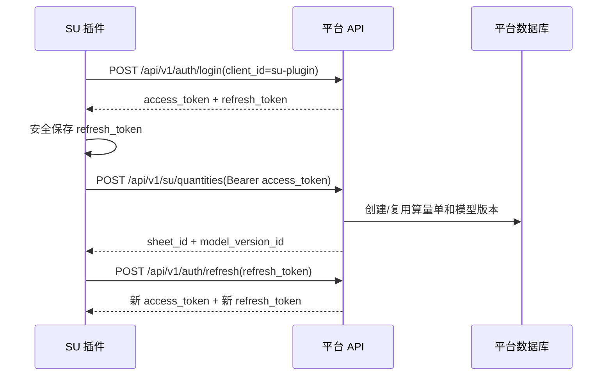

# SU 算量插件接口对接文档

本文面向 SketchUp（SU）算量插件项目，说明插件如何接入本平台的身份认证与智能算量 v2 推送接口。

当前仓库只包含平台侧 API、管理端和智能算量领域实现，不包含 SU 插件本体源码。插件侧需要自行完成 SketchUp 模型解析、payload 组装、token 安全存储、失败重试和 UI 提示。

## 1. 接入方式

### 1.1 生产地址

生产环境应使用 HTTPS 域名作为 API Base URL：

```text
https://gzzyai.com
```

插件调用时按路径拼接：

```text
https://gzzyai.com/api/v1/auth/login
https://gzzyai.com/api/v1/auth/refresh
https://gzzyai.com/api/v1/su/quantities
```

不要在正式环境让插件直连容器端口、内网端口或 `127.0.0.1:8000`。生产部署中 API 容器只监听宿主机本地端口，公网入口由 Nginx 通过 `80/443` 反向代理。

临时联调可以使用服务器公网 IP，例如：

```text
http://<SERVER_IP>/api/v1/su/quantities
```

但只要涉及真实账号、真实项目或正式发布，必须切换为 HTTPS 域名。

### 1.2 客户端标识

SU 插件固定使用：

```text
client_id = su-plugin
```

平台侧已 seed 该客户端，显示名为 `SketchUp 算量插件`。算量推送接口会强校验 JWT 中的 `client_id` 必须等于 `su-plugin`。

### 1.3 权限要求

调用 `POST /api/v1/su/quantities` 必须同时满足：

- access token 有效；
- token 中的 `client_id` 为 `su-plugin`；
- 当前 subject 属于租户上下文；
- 当前租户启用了 `supply` 模块；
- 当前 subject 具备 `quantity:ingest` 权限。

如果用户能登录但推送返回 `403 PERMISSION_DENIED`，通常说明该用户所在租户角色没有绑定 `quantity:ingest`。

### 1.4 接口总览

SU 插件项目按接入优先级分为以下接口：

| 优先级 | 方法 | 接口 | 用途 | 插件是否建议接入 |
| --- | --- | --- | --- | --- |
| 必接 | `POST` | `/api/v1/auth/login` | 插件登录，获取 access token 和 refresh token | 是 |
| 必接 | `POST` | `/api/v1/su/quantities` | 推送 SU v2 算量数据 | 是 |
| 建议 | `POST` | `/api/v1/auth/refresh` | access token 过期后续期 | 是 |
| 建议 | `POST` | `/api/v1/auth/logout` | 插件主动退出登录 | 是 |
| 建议 | `GET` | `/api/v1/identity/me` | 登录后检查当前账号、租户和权限 | 是 |
| 可选 | `GET` | `/api/v1/identity/me/sessions` | 查看当前用户所有会话，辅助排查多端登录 | 按插件 UI 需要 |
| 可选 | `POST` | `/api/v1/su/quantities/failures/{failure_id}/retry` | 使用平台侧失败记录 ID 重放失败推送 | 通常不作为首期必接 |

以下管理端算量接口不建议 SU 插件首期直接接入，除非产品明确要求插件内展示平台算量单详情、运营版本、导出或材料匹配：

| 方法 | 接口 | 说明 |
| --- | --- | --- |
| `GET` | `/api/v1/supply/quantities` | 算量单列表，管理端使用 |
| `GET` | `/api/v1/supply/quantities/{sheet_id}` | 算量单详情，管理端使用 |
| `GET` | `/api/v1/supply/quantities/{sheet_id}/sync-failures` | 同步失败记录列表，管理端使用 |
| `POST` | `/api/v1/supply/quantities/{sheet_id}/sync-failures/{failure_id}/retry` | 管理端按算量单重试失败记录 |
| `POST` | `/api/v1/supply/quantities/{sheet_id}/operation-versions` | 创建运营版本 |
| `PATCH` | `/api/v1/supply/quantities/{sheet_id}/operation-versions/{operation_version_id}/parts/{part_id}` | 匹配 SKU 或调整部品 |
| `GET` | `/api/v1/supply/quantities/{sheet_id}/compare` | 版本对比 |
| `GET` | `/api/v1/supply/quantities/{sheet_id}/exports` | 导出记录 |
| `POST` | `/api/v1/supply/quantities/{sheet_id}/exports` | 创建导出任务 |

## 2. 调用流程



插件建议实现以下状态机：

1. 未登录：展示账号、密码、租户选择入口。
2. 已登录：内存持有 access token，系统安全存储持有 refresh token。
3. 推送中：禁用重复提交，同一模型版本固定使用同一个 `idempotency_key`。
4. token 过期：调用 refresh，成功后重试原请求一次。
5. 权限或租户错误：停止自动重试，提示用户联系管理员。
6. 网络或 429：指数退避后有限次数重试。

## 3. 登录与会话

### 3.1 登录

```http
POST /api/v1/auth/login
Content-Type: application/json
```

请求体：

```json
{
  "username": "designer@example.com",
  "password": "password",
  "client_id": "su-plugin",
  "tenant_id": "tenant-id"
}
```

字段说明：

| 字段 | 类型 | 必填 | 说明 |
| --- | --- | --- | --- |
| `username` | string | 是 | 平台账号用户名 |
| `password` | string | 是 | 平台账号密码 |
| `client_id` | string | 是 | 固定传 `su-plugin` |
| `tenant_id` | string | 否 | 单租户用户可不传；多租户用户应传目标租户 ID |

成功响应：

```json
{
  "access_token": "<jwt>",
  "refresh_token": "<opaque-refresh-token>",
  "expires_in": 3600,
  "subject": {
    "identity_user_id": "user-id",
    "tenant_id": "tenant-id",
    "membership_id": "membership-id",
    "subject_scope": "tenant",
    "client_id": "su-plugin",
    "roles": ["role-code"],
    "permissions": ["quantity:ingest"]
  }
}
```

多租户用户未传 `tenant_id` 时，后端可能返回：

```json
{
  "code": "TENANT_SELECTION_REQUIRED",
  "message": "Please select a tenant",
  "available_tenants": [
    {
      "tenant_id": "tenant-id",
      "tenant_name": "租户名称",
      "roles": []
    }
  ]
}
```

插件应展示租户列表，让用户选择后重新调用登录接口，并带上选中的 `tenant_id`。

### 3.2 刷新 token

```http
POST /api/v1/auth/refresh
Content-Type: application/json
```

请求体：

```json
{
  "refresh_token": "<current-refresh-token>"
}
```

成功响应结构与登录一致。refresh token 是轮换使用的，插件必须用新响应里的 `refresh_token` 覆盖本地旧值。

### 3.3 登出

```http
POST /api/v1/auth/logout
Authorization: Bearer <access_token>
```

成功时返回 `204 No Content`。插件登出后应清除内存中的 access token 和系统安全存储中的 refresh token。

### 3.4 当前登录信息

```http
GET /api/v1/identity/me
Authorization: Bearer <access_token>
```

该接口用于插件登录后自检当前账号、租户和权限。插件建议在登录成功后调用一次，确认响应中的 `client_id` 为 `su-plugin`，且 `permissions` 包含 `quantity:ingest`。如果不包含，应提示用户联系管理员授权。

### 3.5 当前用户会话列表

```http
GET /api/v1/identity/me/sessions
Authorization: Bearer <access_token>
```

该接口用于查看当前用户的会话列表，可辅助排查同一账号在管理端、SU 插件等多个客户端的登录情况。插件首期如果没有“登录设备管理”界面，可以不接。

## 4. SU 算量推送

### 4.1 接口

```http
POST /api/v1/su/quantities
Authorization: Bearer <access_token>
Content-Type: application/json
```

成功响应：

```json
{
  "sheet_id": "quantity-sheet-id",
  "model_version_id": "quantity-model-version-id"
}
```

### 4.2 失败记录重试接口

```http
POST /api/v1/su/quantities/failures/{failure_id}/retry
Authorization: Bearer <access_token>
```

该接口用于按平台侧失败记录 ID 重放失败 payload，鉴权要求与 `POST /api/v1/su/quantities` 一致。

首期插件通常不必依赖该接口，因为插件在本地已经持有原始 payload 时，可以直接用同一个 `idempotency_key` 重新调用 `POST /api/v1/su/quantities`。只有当插件 UI 能拿到平台返回或管理端提供的 `failure_id` 时，才需要接入本接口。

### 4.3 Payload 顶层结构

当前有效 payload 顶层结构如下：

```json
{
  "protocol_version": 2,
  "idempotency_key": "su-XM-001-model-guid-v1",
  "project": {
    "code": "XM-001",
    "name": "样板房"
  },
  "model_key": "sketchup-model-guid",
  "source_version": "2026-07-27T10:30:00+08:00",
  "components": []
}
```

字段说明：

| 字段 | 类型 | 必填 | 说明 |
| --- | --- | --- | --- |
| `protocol_version` | integer | 是 | 固定传 `2` |
| `idempotency_key` | string | 是 | 幂等键；同一次模型版本重复推送必须保持一致 |
| `project.code` | string | 是 | 平台项目编号；同一编号会归入同一算量单 |
| `project.name` | string | 是 | 项目名称；首次创建算量单时使用 |
| `model_key` | string | 是 | SU 模型唯一标识 |
| `source_version` | string | 是 | 插件侧模型版本标识 |
| `components` | array | 是 | 组件列表，可以为空数组 |

幂等规则：

- 同一租户下，`idempotency_key` 已存在时，后端返回已有 `sheet_id` 和 `model_version_id`，不会重复创建模型版本。
- 新的 `idempotency_key` 会创建新的只读模型版本。
- 同一 `project.code` 会复用已有算量单。

### 4.4 Component 结构

```json
{
  "code": "cabinet-1",
  "name": "橱柜",
  "component_type": "cabinet",
  "faces": [],
  "parts": []
}
```

字段说明：

| 字段 | 类型 | 必填 | 说明 |
| --- | --- | --- | --- |
| `code` | string | 是 | 组件稳定编码；同一次 payload 内不可重复 |
| `name` | string | 是 | 组件名称 |
| `component_type` | string | 是 | 组件类型，例如 `cabinet`、`wall`、`floor` |
| `faces` | array | 否 | 面级明细，默认空数组 |
| `parts` | array | 否 | 部品清单，默认空数组 |

### 4.5 Face 结构

```json
{
  "code": "face-1",
  "material_tag": "wood",
  "area_m2": 2.5
}
```

字段说明：

| 字段 | 类型 | 必填 | 说明 |
| --- | --- | --- | --- |
| `code` | string | 是 | 面稳定编码 |
| `material_tag` | string | 是 | 材料标签，用于后续 SKU 匹配 |
| `area_m2` | decimal | 是 | 面面积，单位平方米 |

### 4.6 Part 结构

```json
{
  "code": "part-1",
  "name": "地柜",
  "quantity": 1,
  "unit": "套",
  "material_tag": "wood"
}
```

字段说明：

| 字段 | 类型 | 必填 | 说明 |
| --- | --- | --- | --- |
| `code` | string | 是 | 部品稳定编码 |
| `name` | string | 是 | 部品名称 |
| `quantity` | decimal | 是 | 算量结果 |
| `unit` | string | 是 | 单位，例如 `套`、`件`、`m`、`m2` |
| `material_tag` | string | 是 | 材料标签，用于后续 SKU 匹配 |

### 4.7 完整示例

```json
{
  "protocol_version": 2,
  "idempotency_key": "su-XM-001-model-001-v001",
  "project": {
    "code": "XM-001",
    "name": "样板房"
  },
  "model_key": "model-001",
  "source_version": "v001",
  "components": [
    {
      "code": "cabinet-1",
      "name": "橱柜",
      "component_type": "cabinet",
      "faces": [
        {
          "code": "face-1",
          "material_tag": "wood",
          "area_m2": 2.5
        }
      ],
      "parts": [
        {
          "code": "part-1",
          "name": "地柜",
          "quantity": 1,
          "unit": "套",
          "material_tag": "wood"
        }
      ]
    }
  ]
}
```

## 5. curl 联调示例

### 5.1 登录

```sh
BASE_URL="https://gzzyai.com"

curl -sS \
  -H "Content-Type: application/json" \
  -d '{
    "username": "designer@example.com",
    "password": "password",
    "client_id": "su-plugin",
    "tenant_id": "tenant-id"
  }' \
  "$BASE_URL/api/v1/auth/login"
```

### 5.2 推送

```sh
BASE_URL="https://gzzyai.com"
ACCESS_TOKEN="<access_token>"

curl -sS \
  -H "Content-Type: application/json" \
  -H "Authorization: Bearer $ACCESS_TOKEN" \
  -d '{
    "protocol_version": 2,
    "idempotency_key": "su-XM-001-model-001-v001",
    "project": {
      "code": "XM-001",
      "name": "样板房"
    },
    "model_key": "model-001",
    "source_version": "v001",
    "components": []
  }' \
  "$BASE_URL/api/v1/su/quantities"
```

## 6. Ruby 插件调用骨架

以下示例只展示 HTTP 调用骨架。生产插件还需要补充密码输入 UI、租户选择 UI、系统安全存储、日志脱敏和重试策略。

```ruby
require "json"
require "net/http"
require "uri"

module WangjiaSuClient
  BASE_URL = "https://gzzyai.com"

  def self.post_json(path, body, access_token: nil)
    uri = URI("#{BASE_URL}#{path}")
    request = Net::HTTP::Post.new(uri)
    request["Content-Type"] = "application/json"
    request["Authorization"] = "Bearer #{access_token}" if access_token
    request.body = JSON.generate(body)

    response = Net::HTTP.start(
      uri.hostname,
      uri.port,
      use_ssl: uri.scheme == "https",
      open_timeout: 10,
      read_timeout: 120
    ) do |http|
      http.request(request)
    end

    parsed_body = response.body.nil? || response.body.empty? ? nil : JSON.parse(response.body)
    [response.code.to_i, parsed_body]
  end

  def self.login(username:, password:, tenant_id: nil)
    body = {
      username: username,
      password: password,
      client_id: "su-plugin"
    }
    body[:tenant_id] = tenant_id if tenant_id

    status, result = post_json("/api/v1/auth/login", body)
    raise "登录失败: #{status} #{result}" unless status == 200

    result
  end

  def self.push_quantities(access_token:, payload:)
    status, result = post_json(
      "/api/v1/su/quantities",
      payload,
      access_token: access_token
    )
    raise "算量推送失败: #{status} #{result}" unless status == 200

    result
  end
end
```

## 7. 错误处理建议

| HTTP 状态 | 典型 code | 插件处理建议 |
| --- | --- | --- |
| `400` | `TENANT_SELECTION_REQUIRED` | 展示租户选择，带 `tenant_id` 重新登录 |
| `401` | `AUTH_INVALID` 或 token 错误 | 尝试 refresh；refresh 失败则回到登录 |
| `403` | `WRONG_CLIENT` | 检查登录时是否传了 `client_id=su-plugin` |
| `403` | `PERMISSION_DENIED` | 提示用户缺少 `quantity:ingest`，联系管理员授权 |
| `403` | `MODULE_DISABLED` | 提示租户未启用供应链模块 |
| `422` | `INVALID_QUANTITY_PAYLOAD` | 停止重试，展示 payload 校验错误并记录本地日志 |
| `429` | `RATE_LIMITED` 或 Nginx 限流 | 指数退避后重试 |
| `413` | - | payload 超过网关限制，拆分模型或减少单次推送体积 |
| `5xx` | - | 网络或服务异常，有限次数重试并保留本地失败记录 |

注意：FastAPI schema 层校验失败时也会返回 `422`，这类错误可能不会写入平台失败记录。插件侧仍应保留本地失败 payload 摘要，便于排查。

## 8. 插件侧实现要求

### 8.1 Token 存储

- access token：建议只保存在内存中。
- refresh token：必须放入系统级安全存储。
  - Windows：Credential Manager。
  - macOS：Keychain。
  - Linux：libsecret 或桌面环境提供的安全凭据存储。
- 不要把 token、密码、完整 payload 写入普通日志。

### 8.2 幂等键生成

建议格式：

```text
su-<project_code>-<model_guid>-<source_version>
```

如果插件支持手动重试，同一次模型版本必须复用同一个 `idempotency_key`。

如果用户修改了模型并重新计算，应生成新的 `source_version` 和新的 `idempotency_key`。

### 8.3 编码稳定性

插件应尽量保证以下编码稳定：

- `project.code`：使用平台项目编号，不要使用项目名称代替。
- `model_key`：同一个 SU 模型保持不变。
- `component.code`：同一个组件跨推送尽量保持不变。
- `face.code`：同一个面跨推送尽量保持不变。
- `part.code`：同一个部品跨推送尽量保持不变。

编码越稳定，平台后续版本对比、材料匹配继承和运营复核越可靠。

### 8.4 数值格式

- 面积使用平方米，字段为 `area_m2`。
- 数量使用数字，不要传带单位的字符串。
- 单位单独放入 `unit`。
- decimal 可以用 JSON number，例如 `2.5`，也可以由插件内部按固定精度计算后输出。

### 8.5 超时与重试

推荐：

- 登录接口超时：10 秒。
- 推送接口读取超时：120 秒。
- 429、网络超时、连接失败：指数退避重试 2 到 3 次。
- 401：先 refresh，再重试原请求一次。
- 403、422：不要自动重试，提示用户或记录本地错误。

## 9. 平台侧联调检查清单

插件联调前，平台管理员需要确认：

- 生产域名 HTTPS 可访问：`GET /healthz` 和 `GET /readyz` 通过。
- 目标租户状态 active。
- 目标租户启用了 `supply` 模块。
- 插件使用者账号状态 active。
- 插件使用者是目标租户 active member。
- 插件使用者绑定的租户角色包含 `quantity:ingest`。
- 插件使用 `client_id=su-plugin` 登录。
- 插件推送的 `project.code` 与平台项目编号一致。

## 10. 当前实现边界

当前后端实际接收的 SU payload 以 `apps/api/app/domains/quantity/su_schemas.py` 为准。历史 SU v1 quote 协议已删除，不再支持以下入口或结构：

- `/api/v1/su/quotes`
- `/api/v1/supply/quotes`
- 旧 BoM 数组式 payload
- 旧 quote 域表和响应模型

文档中如需扩展设计师、楼栋、空间范围、插件版本、SU 版本等字段，应先同步更新后端 schema、OpenAPI、API client 和 SU 插件契约，再进入联调。
