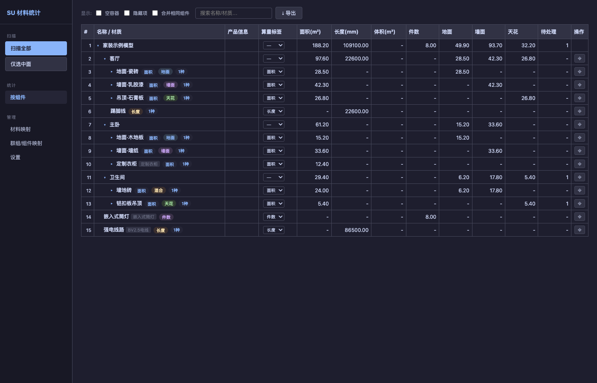
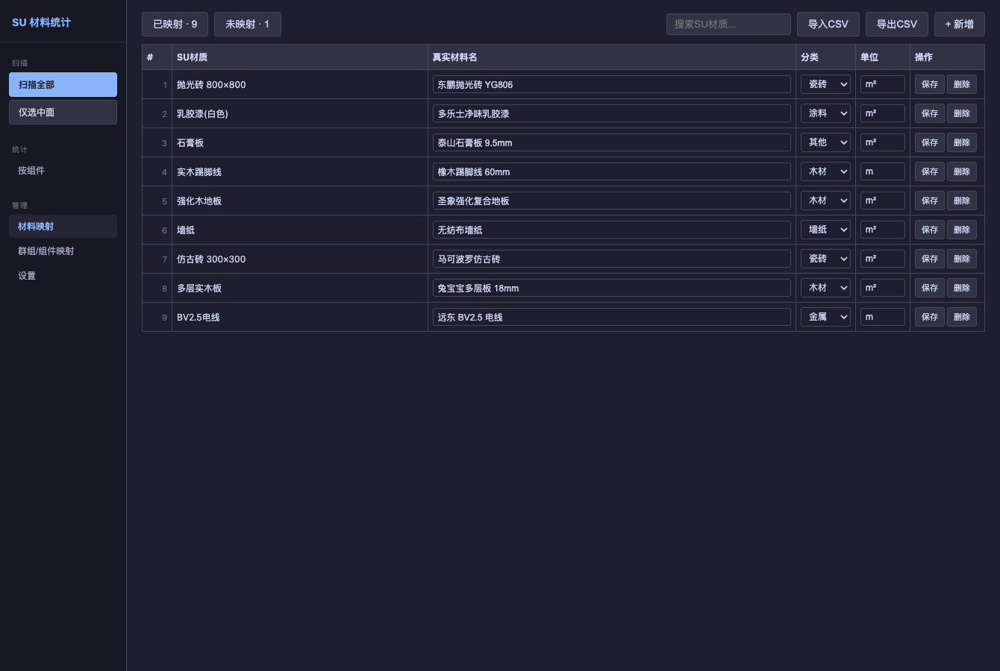
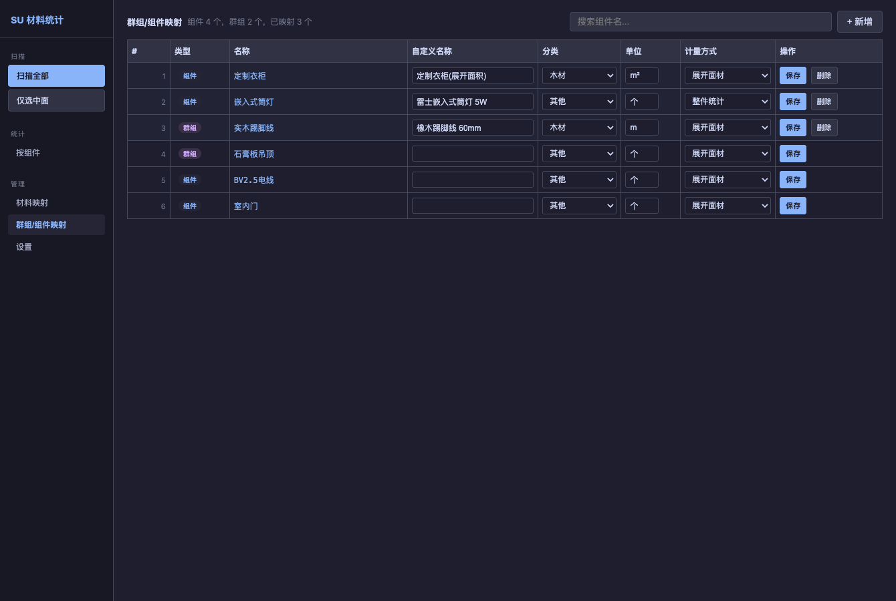
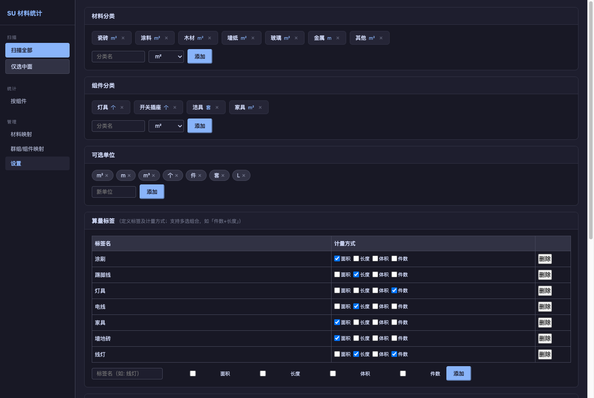

# SU Takeoff —— SketchUp 装修算量与供应链报价工具

> 产品功能介绍

---

## 一、产品概述

**SU Takeoff** 是一款运行于 SketchUp 内部的装修用量统计与报价插件。它直接读取设计师已经建好的 SU 模型，自动识别模型中的面、构件与容器，按 **面积（m²）/ 长度（m）/ 体积（m³）/ 件数（个）** 四种计量方式产出结构化用量报表，并在此基础上对接供应链平台，将用量直接转化为可落地的物料选型与精准报价。

产品的核心设计理念是 **「几何由模型负责，规则由配置负责」**：模型提供准确的三维几何，插件提供清晰、可见、可调的算量规则。每一项算量结果都能追溯到它的判定依据，做到**算得准、看得懂、改得动**。

---

## 二、核心功能



### 1. 模型扫描与自动算量

- 一键扫描整个模型，或仅针对选中部分进行局部算量。
- 递归遍历模型的组件层级，自动收集面、组件实例与实体，无需人工逐个点选。
- 扫描结果实时汇总，模型修改后重新扫描即可得到最新用量，告别手工量尺与重复统计。

### 2. 四种计量方式

同一套模型可同时产出四类工程量，覆盖装修算量的主要场景：

| 计量方式 | 单位 | 典型对象 |
|---|---|---|
| 面积 | m² | 墙面、地面、天花、饰面板 |
| 长度 | m | 踢脚线、收边条、龙骨、电线、管材 |
| 体积 | m³ | 砌体墙、现浇柱梁、保温层 |
| 件数 | 个 / 套 | 灯具、开关、洁具、五金 |

支持**组合计量**：同一构件可同时产出多种工程量（例如线灯既统计「套数」又统计「长度」）。

### 3. 4+1 档算量策略决议

这是保证算量**准确可控**的核心机制。插件按以下优先级判定每个构件的计量方式，任意一档命中即生效：

```
1. 右键标签       在 SU 视口对单个对象显式指定，跟随模型文件保存，优先级最高
2. 图层规则       按图层统一配置（如「线条 → 长度」「砌体 → 体积」）
3. 材质映射       由材料本身的单位反推计量方式
4. 策略自动匹配   按构件命名约定自动识别（如踢脚线、电线、管材）
5. 几何启发式     自动识别窄长面为线材，仅作「待确认建议」，不擅自改结果
```

**显式优于隐式**：几何启发产生的只是带「待确认」标记的建议（视图中以橙色边框提示），由用户确认后才会成为正式结果，确保没有任何用量是「悄悄被改写」的。

### 4. 多维度分组报表

用量结果可按多个维度组织与查看：

- **按组件层级**：树形结构，逐级展开，与模型的组织方式一致。
- **按空间**：自动识别空间归属（如「主卧」「客厅」），便于分房间核算。
- **按部位**：依据面朝向自动划分地面 / 墙面 / 天花。
- **按材料与规格**：按材料分类汇总，并进一步按规格（如板材的宽×高）分组。

### 5. 材料与组件映射

- **材料映射**：将 SketchUp 中的材质名对应到真实材料，维护其分类、单位与规格；支持 JSON 持久化与 CSV 批量导入 / 导出。
- **组件映射**：将组件对应到真实材料。`整件` 模式按个数统计（灯具、开关），`展开` 模式展开统计其面材用量。
- 支持维护「忽略材料」清单，过滤无需算量的辅助材质。





### 6. 专业长度算法库

针对线性构件的复杂性，内置多套长度计算算法并按场景自动选用：

- **体积法**：由实体体积与截面尺寸反推长度，适合闭合实体的条状构件。
- **边线法**：沿构件各方向最长边累加，适合踢脚线、收边条。
- **路径累加法**：直接累加边线路径，适合电线、管道折线。
- **分段路径法**：专为「3D 虚线渲染」建模的电线 / 管材设计，能正确处理重复段叠加的模型，得出真实路径长度。

### 7. 门窗洞口扣减与薄板去重

- **洞口扣减**：自动识别门窗洞口（透明材质或以「门 / 窗」命名的组件），从墙面净面积中扣除。
- **薄板去重**：楼板 / 天花的双面仅保留朝向居住空间的一面；散面建模的踢脚线背靠背两面自动去重，避免同一构件被重复计算。

### 8. 可视化交互与数据导出

- 树形组件视图，支持搜索、展开折叠、空容器与隐藏项过滤、相同组件合并。
- 顶部摘要条实时显示总览统计。
- 算量结果与映射表均支持 **CSV 导出**，便于后续对账、归档或导入其他系统。

---

## 三、供应链协同与精准报价

在准确算量的基础上，SU Takeoff 进一步打通从「用量」到「采购」的链路，将工程量直接转化为可执行的物料清单与报价。

### 1. 对接供应链平台

- 可对接建材供应链平台与材料商，在插件内直接访问平台物料库。
- 支持配置多个供应来源，便于比价与择优。

### 2. 物料精准匹配与选型

- 算量结果（材料分类 + 规格）自动关联到平台中的真实物料 SKU。
- 也支持针对任意用量项**手动指定具体物料**，满足不同品牌、档次的选型需求。
- 物料规格与算量规格对齐，减少「算出来的量」与「实际采购型号」之间的偏差。

### 3. 精准报价生成

- 以「几何用量 × 物料单价」为基础，叠加材料损耗率，自动计算合价。
- 报价可按**空间 / 部位 / 材料**多维度拆分，形成结构清晰、可核对的报价单。
- 设计变更或模型修改后一键重算，用量与报价同步更新，快速响应方案调整。

### 4. 报价输出

- 报价清单支持导出，便于提交、审批、采购与对账。
- 用量与报价同源，确保「报价所依的量」与「模型实际的量」始终一致，降低错漏与争议。

---

## 四、灵活的配置与规则管理



- **规则随模型走**：右键标签写入模型属性字典，规则随 SKP 文件保存，团队成员打开即是同一套已确认的规则。
- **配置即时生效**：图层规则、单位词表、启发式阈值等均在设置页可视化配置，保存后重新扫描即应用，无需改代码。
- **清晰的数据优先级**：模型属性字典 > 项目配置文件 > 默认值，多层级覆盖关系明确。
- **可扩展**：计量规则与命名识别策略支持通过配置文件扩展，适配不同企业的算量习惯。

---

## 五、典型应用场景

- **装修公司 / 施工方**：快速从设计模型产出工程量，用于内部核算、成本控制与投标报价。
- **工程造价 / 预算**：得到分空间、分部位、分材料的结构化用量，作为预算编制与对量依据。
- **材料采购**：基于用量直接选型并生成报价，打通设计与采购，缩短备料周期。

---

## 六、产品特性

- **轻量易用**：以 SketchUp 插件形式运行，无需独立建模，直接复用现有设计成果。
- **准确可控**：四级显式规则 + 待确认机制，算量结果可信、可追溯。
- **数据闭环**：从几何用量到物料报价同源一体，减少二次录入与人为误差。
- **持续扩展**：模块化架构，新增计量方式、识别规则与供应链对接均易于扩展。
